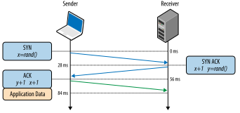

### TCP基础
> TCP 负责在不可靠的传输信道之上提供可靠的抽象层, 它专门为精确传送做了优化
### 三次握手

#### HTTP管道
但HTTP 1.x 只能严格串行地返回响应。特别是，HTTP 1.x 不允许一个连接上的多个响应数据交错到达（多路复用），因而一个响应必须完全返回后，下一个响应才会开始传输, 所以上图的实际结果是

* HTML 和 CSS 请求同时到达，但先处理的是 HTML 请求；
* 服务器并行处理两个请求
* CSS 请求先处理完成，但被缓冲起来以等候发送 HTML 响应, 这种情况通常被称作队首阻塞(HOL blocking)
* 发送完 HTML 响应后，再发送服务器缓冲中的 CSS 响应。

> 因为这种局限性, 如果浏览器是 Web 应用的主要交付工具，那还是很难指望通过 HTTP 管道来提升性能, 所以对于浏览器而言, 该措施流产了

### HTTP2的传输方式
HTTP2，数据传输都是以帧为最小单位进行传输，然后由帧再组成流。在网络两端之间交互传输。在HTTP/1.1中的首部信息会被封装到Headers帧，而我们的request body则被封装到Data帧里面。下图是一个HTTP2帧的结构。其中Type为帧的类型，比如有DATA帧，HEADERS帧等等。

### 反模式
1. 域名拆分
2. 资源内联
3. 资源合并
4. 禁用cookie的域名
5. 生成精灵图片
